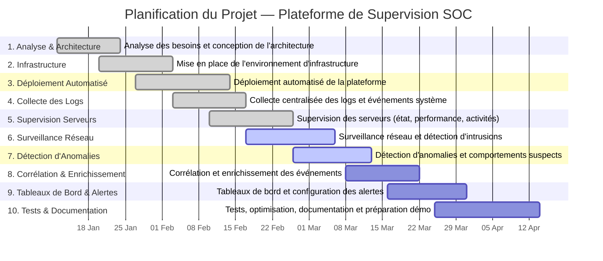

# Diagramme de Gantt — Plateforme SOC (PFE)

```mermaid
gantt
    title Planification du Projet — Plateforme de Supervision SOC
    dateFormat  YYYY-MM-DD
    axisFormat  %d %b

    section 1. Analyse & Architecture
    Analyse des besoins et conception de l'architecture          :done,    t1, 2026-01-12, 12d

    section 2. Infrastructure
    Mise en place de l'environnement d'infrastructure            :done,    t2, 2026-01-20, 14d

    section 3. Déploiement Automatisé
    Déploiement automatisé de la plateforme                      :done,    t3, 2026-01-27, 18d

    section 4. Collecte des Logs
    Collecte centralisée des logs et événements système          :done,    t4, 2026-02-03, 14d

    section 5. Supervision Serveurs
    Supervision des serveurs (état, performance, activités)      :done,    t5, 2026-02-10, 16d

    section 6. Surveillance Réseau
    Surveillance réseau et détection d'intrusions                :active,  t6, 2026-02-17, 17d

    section 7. Détection d'Anomalies
    Détection d'anomalies et comportements suspects              :active,  t7, 2026-02-26, 15d

    section 8. Corrélation & Enrichissement
    Corrélation et enrichissement des événements                 :         t8, 2026-03-08, 14d

    section 9. Tableaux de Bord & Alertes
    Tableaux de bord et configuration des alertes                :         t9, 2026-03-16, 15d

    section 10. Tests & Documentation
    Tests, optimisation, documentation et préparation démo       :         t10, 2026-03-25, 20d
```
