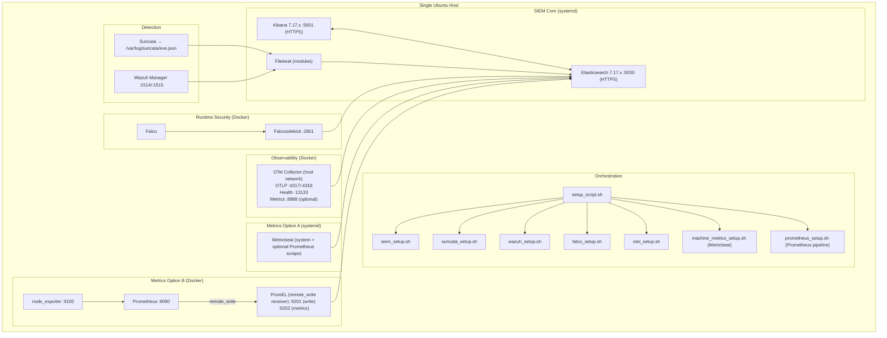

# Complete SOC Platform — Automated Setup (All-in-One SIEM + Detection + Observability)

**Author & Maintainer:** Ghazi Mabrouki  
**Version:** 2.1

A complete **Security Operations Center (SOC)** platform that automates deployment of enterprise-grade monitoring tools on **a single machine**.  
All components integrate with **Elasticsearch** for centralized search, correlation, and visualization via **Kibana**.

> ✅ Goal: **one command** to deploy a complete SOC stack for labs, PoCs, demos, training, and security validation.

---

## What You Get

- **SIEM Core:** Elasticsearch + Kibana + Filebeat  
- **Network Detection:** Suricata (NIDS)  
- **Host Detection:** Wazuh Manager (HIDS)  
- **Runtime Detection:** Falco + Falcosidekick  
- **Observability:** OpenTelemetry Collector (logs / traces / optional metrics)  
- **Infrastructure Metrics (Option A):** Metricbeat (`metricbeat-*`)  
- **Infrastructure Metrics (Option B):** Prometheus + node_exporter + PromEL → Elasticsearch (`prometheus-metrics-*`)

✅ Prometheus pipeline is **additive** and does **not disable/delete** Metricbeat/OTel/Filebeat/Wazuh/Falco by default.

---

## Architecture (High Level)

```
Collectors/Agents (Suricata, Wazuh, Falco, OTel, Metricbeat, Prometheus)
                │
                ▼
        Elasticsearch (SIEM Core)
                │
                ▼
              Kibana
```

---

## Detailed Architecture (Topology)



---

## Components

### 1) SIEM Stack (Elasticsearch + Kibana + Filebeat)
- Elasticsearch **7.17.x** (storage/search)
- Kibana **7.17.x** (UI/dashboards)
- Filebeat (log shipper + modules)

### 2) Suricata (Network IDS/IPS)
- EVE output: `/var/log/suricata/eve.json`
- Shipped by Filebeat to `filebeat-*`

### 3) Wazuh Manager (Host IDS)
- Agent ports: `1514/tcp` (events), `1515/tcp` (registration)
- Alerts to `wazuh-alerts-*` (via Filebeat module)

### 4) Falco + Falcosidekick (Runtime Security)
- Falco detects syscall/rule events
- Falcosidekick forwards to Elasticsearch (`falco-events-*`)

### 5) OpenTelemetry Collector (Observability)
- Receivers: OTLP gRPC `:4317`, OTLP HTTP `:4318`
- Exports: `otel-logs-*`, `otel-traces-*` (metrics optional by config)

### 6) Metricbeat (Infrastructure Metrics) — Option A
- Host metrics to `metricbeat-*`
- Optional Prometheus scraping (e.g., OTel `:8888/metrics`)

### 7) Prometheus Pipeline — Option B
- Containers:
  - `soc-node-exporter` → exposes host metrics via mounts
  - `soc-prometheus` → scrapes exporters
  - `soc-promel` → receives remote_write, indexes into Elasticsearch
- Index: `prometheus-metrics-*`
- Kibana data view: `prometheus-metrics-*` (time field: `datetime`)

---

## Requirements

- Ubuntu **20.04+**
- RAM: **8 GB** (16 GB recommended)
- Disk: **50 GB** (100 GB recommended)
- CPU: **4 cores** (8+ recommended)
- Internet connectivity

---

## Quick Start

```bash
git clone https://github.com/Ghazimabrouki/PFE-17-02-2026/
cd PFE-17-02-2026
chmod +x *.sh
sudo ./setup_script.sh
```

---

## Installation Order

1. SIEM (Elasticsearch/Kibana/Filebeat)
2. Suricata
3. Wazuh
4. Falco + Falcosidekick
5. OpenTelemetry
6. Metricbeat *(optional)*
7. Prometheus pipeline *(optional)*

---

## Access & Verification

### Kibana
```bash
hostname -I
# Open: https://YOUR_SERVER_IP:5601
```

### Systemd services
```bash
for svc in elasticsearch kibana filebeat suricata wazuh-manager metricbeat; do
  systemctl is-active --quiet "$svc" && echo "✓ $svc" || echo "✗ $svc"
done
```

### Docker services
```bash
docker ps --format 'table {{.Names}}	{{.Image}}	{{.Status}}	{{.Ports}}'
```

### Elasticsearch indices
```bash
curl -k -u elastic:PASSWORD "https://localhost:9200/_cat/indices?v"
```

---

## Data Flow

- Suricata → Filebeat → Elasticsearch (`filebeat-*`)
- Wazuh → Filebeat → Elasticsearch (`wazuh-alerts-*`)
- Falco → Falcosidekick → Elasticsearch (`falco-events-*`)
- OpenTelemetry → Elasticsearch (`otel-logs-*`, `otel-traces-*`)
- Metricbeat → Elasticsearch (`metricbeat-*`)
- Prometheus → PromEL → Elasticsearch (`prometheus-metrics-*`)

---

## Network Ports

| Service | Port | Protocol | Purpose |
|---|---:|---|---|
| Elasticsearch | 9200 | HTTPS | REST API |
| Kibana | 5601 | HTTPS | Web UI |
| Wazuh Manager | 1514 | TCP | Agent events |
| Wazuh Manager | 1515 | TCP | Agent registration |
| Falcosidekick | 2801 | HTTP | Falco event receiver |
| OTLP gRPC | 4317 | gRPC | Telemetry |
| OTLP HTTP | 4318 | HTTP | Telemetry |
| OTel Health | 13133 | HTTP | Health check |
| OTel Metrics | 8888 | HTTP | Metrics *(optional)* |
| Prometheus UI/API | 9090 | HTTP | Prometheus *(optional)* |
| node_exporter | 9100 | HTTP | Host metrics *(optional)* |
| PromEL write | 9201 | HTTP | remote_write receiver *(optional)* |
| PromEL metrics | 9202 | HTTP | PromEL metrics *(optional)* |

---

## Index Patterns & Indices

- `filebeat-*` → Suricata + system logs
- `wazuh-alerts-*` → Wazuh alerts
- `falco-events-*` → Falco events
- `otel-logs-*`, `otel-traces-*` → OTel exports
- `metricbeat-*` → Metricbeat system metrics
- `prometheus-metrics-*` → Prometheus metrics via PromEL

---

## Testing & Validation

### Falco
```bash
sudo cat /etc/shadow
```

### OTel
```bash
curl -s http://localhost:13133 || true
curl -s http://localhost:8888/metrics | head -n 20 || true
```

### Prometheus pipeline
```bash
curl -s http://localhost:9100/metrics | head
curl -s http://localhost:9090/api/v1/targets | head
curl -k -u elastic:PASSWORD "https://localhost:9200/_cat/indices/prometheus-metrics*?h=index,docs.count"
```

---

## OpenSearch Support (Patched)

Falco and OTel scripts can target OpenSearch (or any ES-compatible endpoint):

```bash
export OPENSEARCH_URL="https://10.0.0.10:9200"
export OPENSEARCH_USERNAME="admin"
export OPENSEARCH_PASSWORD="your_password"
```

---

## License
See `LICENSE`.

---

## Credits
- Elasticsearch & Kibana — Elastic NV  
- Suricata — Open Information Security Foundation (OISF)  
- Wazuh — Wazuh, Inc.  
- Falco — The Falco Project (CNCF)  
- Falcosidekick — Falco Security  
- OpenTelemetry — OpenTelemetry Project (CNCF)  

---
