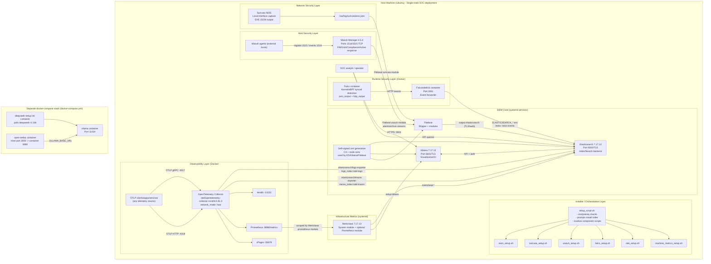
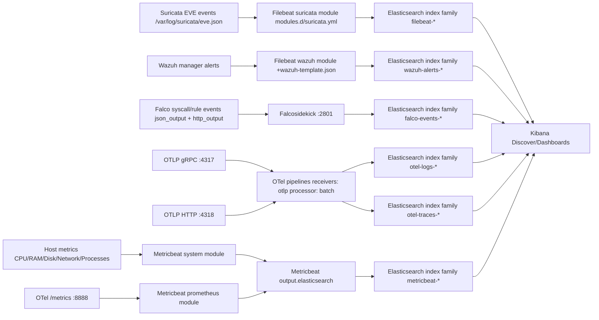
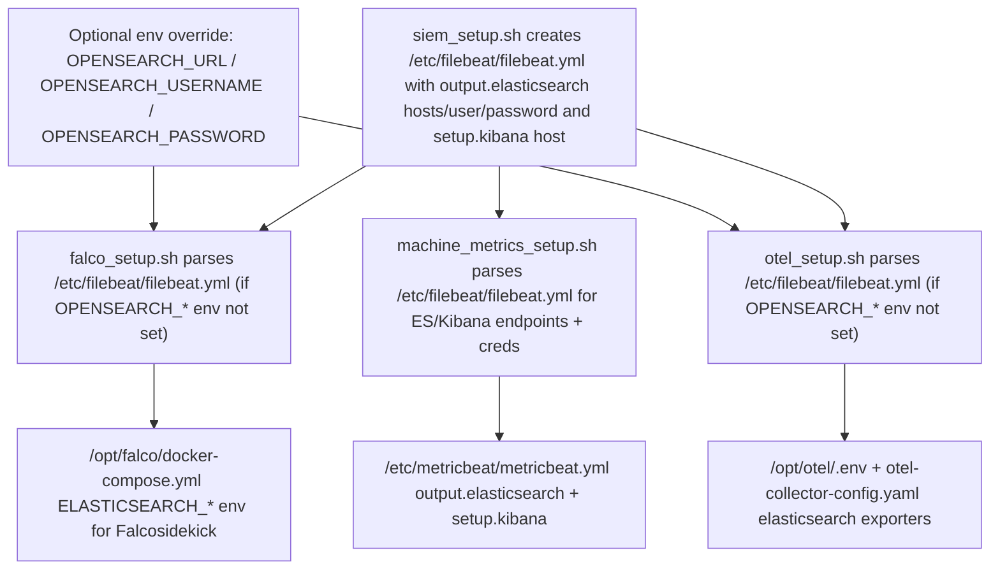
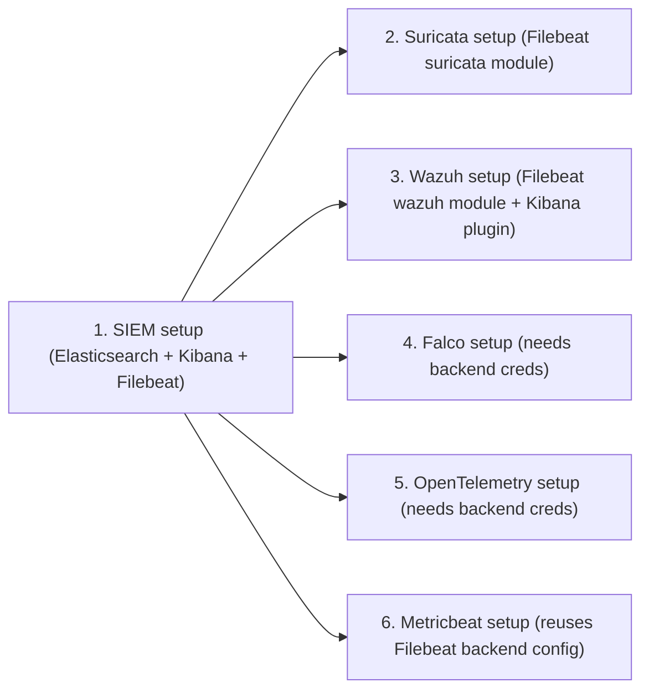

# Complete SOC Platform — Automated Setup (All-in-One SIEM + Detection + Observability)

**Author & Maintainer:** Ghazi Mabrouki  
**Version:** 2.0

A complete **Security Operations Center (SOC)** platform that automates deployment of enterprise-grade monitoring tools on **a single machine**.  
All components integrate with **Elasticsearch** for centralized search, correlation, and visualization via **Kibana**.

> ✅ Goal: one command to deploy a complete SOC stack for labs, PoCs, demos, training, and security validation.

---

## Table of Contents
- [What You Get](#what-you-get)
- [Architecture](#architecture)
- [Components](#components)
  - [1) SIEM Stack (Elasticsearch + Kibana + Filebeat)](#1-siem-stack-elasticsearch--kibana--filebeat)
  - [2) Suricata (Network IDS/IPS)](#2-suricata-network-idsips)
  - [3) Wazuh Manager (Host IDS)](#3-wazuh-manager-host-ids)
  - [4) Falco + Falcosidekick (Runtime Security)](#4-falco--falcosidekick-runtime-security)
  - [5) OpenTelemetry Collector (Observability)](#5-opentelemetry-collector-observability)
  - [6) Metricbeat (Infrastructure & Prometheus Metrics)](#6-metricbeat-infrastructure--prometheus-metrics)
- [Requirements](#requirements)
- [Quick Start](#quick-start)
- [Installation Order](#installation-order)
- [Access & Verification](#access--verification)
- [Data Flow](#data-flow)
- [Network Ports](#network-ports)
- [Index Patterns & Indices](#index-patterns--indices)
- [Metricbeat Setup (Optional / Recommended)](#metricbeat-setup-optional--recommended)
- [Testing & Validation](#testing--validation)
- [Troubleshooting](#troubleshooting)
- [Security Best Practices](#security-best-practices)
- [Maintenance](#maintenance)
- [Uninstallation](#uninstallation)
- [OpenSearch Support (Patched)](#opensearch-support-patched)
- [License](#license)
- [Credits](#credits)

---

## What You Get

This project deploys and integrates:

- **SIEM Core:** Elasticsearch + Kibana + Filebeat  
- **Network Detection:** Suricata (NIDS)  
- **Host Detection:** Wazuh Manager (HIDS)  
- **Runtime Detection:** Falco + Falcosidekick  
- **Observability:** OpenTelemetry Collector (logs / metrics / traces)  
- **Metrics Shipping (Optional/Recommended):** Metricbeat (System + Prometheus metrics)

All data lands in Elasticsearch with dedicated index patterns for fast investigation in Kibana.

---

## Architecture

```
┌─────────────────────────────────────────────────────────────────────────┐
│                         Data Collection Layer                            │
├─────────────────────────────────────────────────────────────────────────┤
│  Suricata  │  Wazuh    │  Falco    │  OpenTelemetry  │    Metricbeat     │
│  (Network) │  (Host)   │ (Runtime) │ (Observability) │ (System/Prometheus)│
└──────┬──────────┬───────────┬────────────┬───────────────┬───────────────┘
       │          │           │            │               │
       │          │      ┌────▼────┐       │               │
       │          │      │ Sidekick│       │               │
       │          │      └────┬────┘       │               │
       └──────────┴───────────┴────────────┴───────────────┴───────────────┐
                                                                             │
                                  ┌──────────────────────────────────────────▼─┐
                                  │               Elasticsearch                 │
                                  │                 (SIEM Core)                 │
                                  └──────────────────────────┬──────────────────┘
                                                             │
                                  ┌──────────────────────────▼──────────────────┐
                                  │                    Kibana                   │
                                  │              (Visualization / UI)           │
                                  └─────────────────────────────────────────────┘
```

---

# Detailed Project Diagram (Services, Interactions, and Log Transit)

This document maps the full platform described by this repository, including setup orchestration, runtime service interactions, and telemetry/log paths into Elasticsearch/OpenSearch-compatible backends.

## 1) End-to-End Service Topology



## 2) Detailed Log/Telemetry Transit Paths



## 3) Control-Plane and Credential/Config Dependency Flow



## 4) Installation/Startup Dependency Graph



## 5) Port-Level Interaction Map

```mermaid
flowchart TB
  ES9200["Elasticsearch :9200 HTTPS"]
  KB5601["Kibana :5601 HTTPS"]
  W1514["Wazuh :1514 TCP"]
  W1515["Wazuh :1515 TCP"]
  F2801["Falcosidekick :2801 HTTP"]
  O4317["OTel OTLP gRPC :4317"]
  O4318["OTel OTLP HTTP :4318"]
  O13133["OTel Health :13133"]
  O8888["OTel Metrics :8888"]
  O55679["OTel zPages :55679"]
  OLLAMA11434["Ollama :11434"]
  WEBUI3000["Open-WebUI :3000 -> 8080"]

  Filebeat["Filebeat"] --> ES9200
  Kibana["Kibana server"] --> ES9200
  Analyst["Browser/Operator"] --> KB5601
  Agents["Wazuh agents"] --> W1515
  Agents --> W1514
  Falco["Falco"] --> F2801
  Falcosidekick["Falcosidekick"] --> ES9200
  OTLPClients["Telemetry clients"] --> O4317
  OTLPClients --> O4318
  Metricbeat["Metricbeat prometheus module"] --> O8888
  OTEL["OTel Collector"] --> O13133
  OTEL --> O55679
  OTEL --> ES9200
  WebUI["Open-WebUI"] --> OLLAMA11434
  UserAI["AI UI user"] --> WEBUI3000
```




## Components

### 1) SIEM Stack (Elasticsearch + Kibana + Filebeat)
- Elasticsearch **7.17.13** (core storage/search)
- Kibana **7.17.13** (dashboards + investigation)
- Filebeat (log shipper)

**Features**
- Centralized log management
- Real-time search and analytics
- TLS/SSL support
- Authentication & access control

---

### 2) Suricata (Network IDS/IPS)
High-performance network IDS with deep protocol inspection and signatures.

**Integration**
- Events: `/var/log/suricata/eve.json`
- Shipped via Filebeat to Elasticsearch (`filebeat-*`)
- Designed for Kibana dashboards

> Note: Suricata monitors the local interface. To monitor full network traffic, feed it via **TAP/SPAN**.

---

### 3) Wazuh Manager (Host IDS)
Wazuh Manager **4.5** provides:
- FIM (File Integrity Monitoring)
- Vulnerability detection
- Configuration assessment / compliance (PCI DSS, GDPR, HIPAA)
- Active response

**Integration**
- Alerts indexed into Elasticsearch (`wazuh-alerts-*`)
- Visualized in Kibana (Wazuh app/plugin when applicable)

---

### 4) Falco + Falcosidekick (Runtime Security)
- Falco monitors kernel/system calls (eBPF)
- Falcosidekick forwards Falco events to Elasticsearch

**Integration**
- Falco → Falcosidekick → Elasticsearch (`falco-events-*`)
- Optional backup log: `/var/log/falco/events.json`

**Examples of detections**
- Sensitive file reads (`/etc/shadow`, `/etc/sudoers`)
- Privilege escalation patterns
- Reverse shells
- Package manager execution
- Crypto-mining behavior

---

### 5) OpenTelemetry Collector (Observability)
- OTLP ingestion (gRPC/HTTP)
- Metrics + logs + traces
- Prometheus scrape endpoint
- Exports to Elasticsearch indices:
  - `otel-logs-*`
  - `otel-metrics-*`
  - `otel-traces-*`

**Useful endpoints**
- Health: `http://localhost:13133`
- Prometheus metrics: `http://localhost:8888/metrics`

---

### 6) Metricbeat (Infrastructure & Prometheus Metrics)
Metricbeat is the Elastic-native agent for **system metrics** and **Prometheus-style metrics** ingestion. It complements the platform by providing:
- Host system metrics (CPU/RAM/Disk/Network)
- Service metrics
- Prometheus endpoint scraping (e.g., scraping OpenTelemetry Collector `/metrics`)

**Integration**
- Metricbeat → Elasticsearch (`metricbeat-*`)

> If you already rely fully on OpenTelemetry for metrics, Metricbeat can remain optional.  
> For many SOC lab setups, Metricbeat is still very useful for quick host visibility + Prometheus scraping.

---

## Requirements

### Minimum (Lab)
- Ubuntu **20.04+** (18.04 supported if scripts allow)
- RAM: **8 GB** (16 GB recommended)
- Disk: **50 GB** (100 GB recommended)
- CPU: **4 cores** (8 cores recommended)
- Internet connectivity

### Recommended resources per component
| Component | RAM | Disk | CPU |
|---|---:|---:|---:|
| Elasticsearch + Kibana | 4GB | 20GB | 2 cores |
| Suricata | 2GB | 5GB | 2 cores |
| Wazuh | 2GB | 10GB | 1 core |
| Falco + Sidekick | 1GB | 5GB | 1 core |
| OpenTelemetry | 1GB | 10GB | 1 core |
| Metricbeat | 256MB–512MB | <1GB | low |

---

## Quick Start

```bash
git clone https://github.com/Ghazimabrouki/PFE-17-02-2026/
cd PFE-17-02-2026

chmod +x *.sh

sudo ./setup_script.sh
```

---

## Installation Order

The platform is installed in dependency order:

1. **SIEM** (foundation: Elasticsearch/Kibana/Filebeat)
2. **Suricata** (network telemetry)
3. **Wazuh** (host security)
4. **Falco + Falcosidekick** (runtime security)
5. **OpenTelemetry** (observability)
6. **Metricbeat** (system + Prometheus metrics) *(optional/recommended)*

### Run a single component
```bash
sudo ./siem_setup.sh
sudo ./suricata_setup.sh
sudo ./wazuh_setup.sh
sudo ./falco_setup.sh
sudo ./otel_setup.sh
sudo ./metricbeat_setup.sh
```

---

## Access & Verification

### Kibana
```bash
hostname -I
# Open: https://YOUR_SERVER_IP:5601
```

### Quick service status
```bash
for svc in elasticsearch kibana filebeat suricata wazuh-manager falco-modern-bpf falcosidekick otelcol-contrib metricbeat; do
  systemctl is-active --quiet $svc && echo "✓ $svc" || echo "✗ $svc"
done
```

### Check Elasticsearch indices
```bash
curl -k -u elastic:PASSWORD "https://localhost:9200/_cat/indices?v"
```

---

## Data Flow

- **Suricata → Filebeat → Elasticsearch**
  - `/var/log/suricata/eve.json → filebeat-*`
- **Wazuh → Elasticsearch**
  - `wazuh-alerts-*`
- **Falco → Falcosidekick → Elasticsearch**
  - `falco-events-*`
- **OpenTelemetry → Elasticsearch**
  - `otel-logs-*`, `otel-metrics-*`, `otel-traces-*`
- **Metricbeat → Elasticsearch**
  - `metricbeat-*`
  - Optional: Metricbeat Prometheus module scraping `http://localhost:8888/metrics`

---

## Network Ports

| Service | Port | Protocol | Purpose |
|---|---:|---|---|
| Elasticsearch | 9200 | HTTPS | REST API |
| Kibana | 5601 | HTTPS | Web UI |
| Wazuh Manager | 1514 | TCP | Agent communication |
| Wazuh Manager | 1515 | TCP | Agent registration |
| Falcosidekick | 2801 | HTTP | Falco event receiver |
| Falco Webserver | 8765 | HTTP | Metrics/Health |
| OTLP gRPC | 4317 | gRPC | Telemetry |
| OTLP HTTP | 4318 | HTTP | Telemetry |
| OTel Health | 13133 | HTTP | Health check |
| OTel Metrics | 8888 | HTTP | Prometheus metrics |
| OTel zPages | 55679 | HTTP | Debug |
| Metricbeat | — | — | Agent (ships metrics to ES) |

---

## Index Patterns & Indices

**Indices**
- `filebeat-*` → system logs + Suricata events
- `wazuh-alerts-*` → Wazuh alerts
- `falco-events-*` → Falco runtime security events
- `otel-logs-*` / `otel-metrics-*` / `otel-traces-*` → OpenTelemetry exports
- `metricbeat-*` → host metrics + Prometheus-scraped metrics (optional)

**Kibana Discover filters**
- Suricata: `event.dataset: suricata.eve`
- Wazuh: `agent.type: wazuh`
- Falco: index `falco-events-*`
- OTel: index `otel-*`
- Metricbeat: index `metricbeat-*`

---

## Metricbeat Setup (Optional / Recommended)

Install Metricbeat (Elastic 7.17.13, Ubuntu DEB):

```bash
curl -L -O https://artifacts.elastic.co/downloads/beats/metricbeat/metricbeat-7.17.13-amd64.deb
sudo dpkg -i metricbeat-7.17.13-amd64.deb
```

### Configure output to Elasticsearch
Edit: `/etc/metricbeat/metricbeat.yml`

```yaml
output.elasticsearch:
  hosts: ["https://localhost:9200"]
  username: "elastic"
  password: "PASSWORD"
  ssl.verification_mode: none
```

### Enable modules
```bash
sudo metricbeat modules enable system
sudo metricbeat modules enable prometheus
```

### Prometheus scraping (example: scrape OTel Collector metrics)
Edit: `/etc/metricbeat/modules.d/prometheus.yml`

```yaml
- module: prometheus
  period: 10s
  hosts: ["localhost:8888"]
  metrics_path: /metrics
```

### Start Metricbeat
```bash
sudo systemctl enable metricbeat
sudo systemctl start metricbeat
sudo systemctl status metricbeat --no-pager
```

---

## Testing & Validation

### Test Falco detections
```bash
sudo cat /etc/shadow
sudo apt-get update
tail -f /var/log/falco/events.json
```

### Query Falco events in Elasticsearch
```bash
curl -k -u elastic:PASSWORD "https://localhost:9200/falco-events-*/_search?pretty"
```

### Test OpenTelemetry
```bash
curl http://localhost:13133
curl http://localhost:8888/metrics
```

### Test Metricbeat
```bash
curl -k -u elastic:PASSWORD "https://localhost:9200/metricbeat-*/_search?pretty"
```

---

## Troubleshooting

### Service not starting
```bash
systemctl status SERVICE_NAME
journalctl -u SERVICE_NAME -n 100 --no-pager
```

### Validate configs
```bash
# OpenTelemetry
/usr/local/bin/otelcol-contrib --config=/etc/otelcol-contrib/config.yaml validate

# Filebeat
filebeat test config
filebeat test output
```

### No data in Kibana
```bash
curl -k -u elastic:PASSWORD "https://localhost:9200/_cat/indices?v"
systemctl restart filebeat
```

### High resource usage (Elasticsearch heap)
Edit: `/etc/elasticsearch/jvm.options`  
Set (example):
```
-Xms2g
-Xmx2g
```
Restart:
```bash
systemctl restart elasticsearch
```

---

## Security Best Practices

- Change default passwords immediately (especially `elastic`)
- Restrict Kibana access (IP allowlist / VPN only)
- Enable firewall (example)
  ```bash
  ufw allow from TRUSTED_IP to any port 5601 proto tcp
  ufw enable
  ```
- Replace self-signed certs with real certificates in production
- Define retention (ILM policies) for all indices
- Take regular snapshots/backups

---

## Maintenance

### Daily
```bash
# optional if included in repo
./health_check.sh
```

### Weekly
```bash
suricata-update
systemctl reload suricata
df -h
```

### Monthly
```bash
apt-get update && apt-get upgrade -y
```

---

## Uninstallation

> This removes components and deletes related configuration/log folders. Use with caution.

```bash
systemctl stop elasticsearch kibana filebeat suricata wazuh-manager falco-modern-bpf falcosidekick otelcol-contrib metricbeat

apt-get purge elasticsearch kibana filebeat suricata wazuh-manager falco metricbeat -y

rm -rf   /etc/elasticsearch /etc/kibana /etc/filebeat /etc/suricata   /etc/falco /etc/falcosidekick /etc/otelcol-contrib   /etc/metricbeat /var/lib/metricbeat   /var/ossec /var/log/falco /var/log/otelcol
```

---

## OpenSearch Support (Patched)

Falco and OpenTelemetry scripts can send data to **OpenSearch** (or Elasticsearch-compatible endpoints).  
Override the backend without touching Filebeat:

```bash
export OPENSEARCH_URL="https://10.0.0.10:9200"
export OPENSEARCH_USERNAME="admin"
export OPENSEARCH_PASSWORD="your_password"
```

If not set, scripts attempt to parse:  
`/etc/filebeat/filebeat.yml` (`output.elasticsearch.*`).

---

flowchart LR
  %% =========================================================
  %% COMPLETE SOC PLATFORM — ALL-IN-ONE (Installer + Runtime + Data Flow)
  %% =========================================================

  %% -------------------------
  %% External actors / inputs
  %% -------------------------
  subgraph EXT["External Systems / Users"]
    B["SOC Analyst (Browser) → https://HOST:5601"]
    A["Wazuh Agents (endpoints) → TCP 1514/1515"]
    APP["Apps / Services instrumented with OTel SDK → OTLP 4317/4318"]
  end

  %% -------------------------
  %% Installer orchestration
  %% -------------------------
  subgraph INSTALL["Automated Installer (dependency order)"]
    direction TB
    SS["setup_script.sh (prompts per component) installs Docker/Compose if needed"]
    STEP1["1) siem_setup.sh Elastic+Kibana+Filebeat 7.17.13 TLS + xpack.security"]
    STEP2["2) suricata_setup.sh Interface auto-detect Suricata + filebeat module"]
    STEP3["3) wazuh_setup.sh Wazuh Manager 4.5.4-1 Wazuh Filebeat module + Kibana plugin"]
    STEP4["4) falco_setup.sh Docker: Falco + Falcosidekick"]
    STEP5["5) otel_setup.sh (patched) Docker: OTel Collector (logs+traces export)"]
    STEP6["6) machine_metrics_setup.sh Metricbeat (system metrics) Dashboards best-effort"]

    SS -->|"run"| STEP1 --> STEP2 --> STEP3 --> STEP4 --> STEP5 --> STEP6
  end

  %% -------------------------
  %% SOC Host: SIEM core
  %% -------------------------
  subgraph HOST["Single Ubuntu Host (All components on one machine)"]
    direction LR

    %% ---- SIEM foundation ----
    subgraph SIEM["SIEM Core (systemd)"]
      direction TB
      ES["Elasticsearch 7.17.13 HTTPS :9200 /etc/elasticsearch/* /etc/elasticsearch/certs/*"]
      KB["Kibana 7.17.13 HTTPS :5601 /etc/kibana/kibana.yml /etc/kibana/certs/* (+ Wazuh plugin)"]
      FB["Filebeat 7.17.13 /etc/filebeat/filebeat.yml /etc/filebeat/modules.d/* /etc/filebeat/certs/*"]
      KB -->|"https (xpack security)"| ES
    end

    %% ---- Detection layer ----
    subgraph DETECT["Detection Layer"]
      direction TB
      SUR["Suricata (NIDS) /etc/suricata/suricata.yaml writes: /var/log/suricata/eve.json (monitors active IFACE)"]
      WZ["Wazuh Manager 4.5.4-1 (HIDS) TCP 1514 (events) TCP 1515 (registration) /var/ossec/*"]
    end

    %% ---- Runtime security (Docker) ----
    subgraph RUNTIME["Runtime Security (Docker)"]
      direction TB
      FALCO["Falco (privileged) json_output + http_output sends → http://falcosidekick:2801/ /opt/falco/docker-compose.yml"]
      FSK["Falcosidekick HTTP :2801 ELASTICSEARCH_INDEX=falco-events /opt/falco/docker-compose.yml"]
      FALCO -->|"HTTP events"| FSK
    end

    %% ---- Observability (Docker) ----
    subgraph OBS["Observability (Docker)"]
      direction TB
      OTEL["OpenTelemetry Collector (contrib 0.91.0) network_mode=host OTLP gRPC :4317 OTLP HTTP :4318 Health :13133 /opt/otel/.env /opt/otel/otel-collector-config.yaml /opt/otel/docker-compose.yml Exports: otel-logs, otel-traces"]
      OTEL_METRICS["Optional / if enabled in config: Prometheus metrics endpoint :8888 (+ zPages :55679)"]
      OTEL -. "optional metrics endpoint" .-> OTEL_METRICS
    end

    %% ---- Metrics shipping (systemd) ----
    subgraph METRICS["Infrastructure Metrics (systemd)"]
      direction TB
      MB["Metricbeat /etc/metricbeat/metricbeat.yml /etc/metricbeat/modules.d/system.yml system metricsets: cpu/mem/disk/net/proc... Loads dashboards (best-effort)"]
      MBPROM["Optional: Metricbeat Prometheus module scrape localhost:8888/metrics"]
      MBPROM -. "scrape" .-> OTEL_METRICS
      MB -. "optional module" .-> MBPROM
    end

    %% -------------------------
    %% Backend target resolution (Falco/OTel)
    %% -------------------------
    RESOLVE{"Backend resolution (Falco/OTel) 1) OPENSEARCH_* or ES_* 2) else parse /etc/filebeat/filebeat.yml (output.elasticsearch.*)"}
  end

  %% -------------------------
  %% Data flow into Elasticsearch indices
  %% -------------------------
  subgraph DATA["Elasticsearch Indices / Patterns"]
    direction TB
    IDX_FB["filebeat-* (system logs + Suricata) Discover filter: event.dataset: suricata.eve"]
    IDX_WZ["wazuh-alerts-* Discover filter: agent.type: wazuh"]
    IDX_FAL["falco-events-* (runtime detections)"]
    IDX_OTL["otel-logs-* (logs)"]
    IDX_OTT["otel-traces-* (traces)"]
    IDX_MB["metricbeat-* Discover filter: event.module: system"]
  end

  %% -------------------------
  %% External connections
  %% -------------------------
  B -->|"5601/HTTPS"| KB
  A -->|"1514/1515 TCP"| WZ
  APP -->|"OTLP 4317/4318"| OTEL

  %% -------------------------
  %% Internal data pipelines
  %% -------------------------
  SUR -->|"eve.json"| FB
  WZ -->|"alerts via Filebeat wazuh module"| FB

  FB -->|"ships logs"| ES
  MB -->|"ships metrics"| ES

  %% Falco/OTel use resolved backend (Elastic/OpenSearch compatible)
  FSK -->|"bulk ingest falco-events-*"| RESOLVE
  OTEL -->|"export logs+traces otel-logs / otel-traces"| RESOLVE
  RESOLVE -->|"HTTPS :9200"| ES

  %% -------------------------
  %% Index mapping (conceptual)
  %% -------------------------
  ES --> IDX_FB
  ES --> IDX_WZ
  ES --> IDX_FAL
  ES --> IDX_OTL
  ES --> IDX_OTT
  ES --> IDX_MB


## License
See `LICENSE`.

---

## Credits

- Elasticsearch & Kibana — Elastic NV
- Suricata — Open Information Security Foundation (OISF)
- Wazuh — Wazuh, Inc.
- Falco — The Falco Project (CNCF)
- Falcosidekick — Falco Security
- OpenTelemetry — OpenTelemetry Project (CNCF)

---

## About the Author

**Ghazi Mabrouki** — SOC Platform Developer  
This platform was designed to provide an automated, unified monitoring and security detection stack for organizations and labs.
