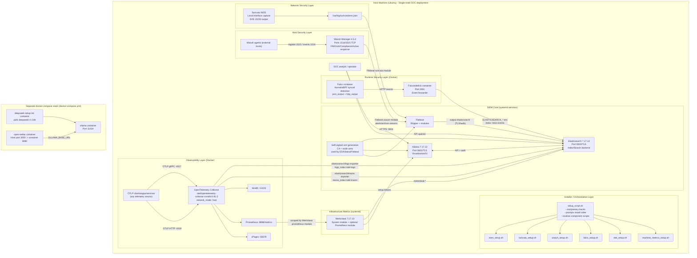
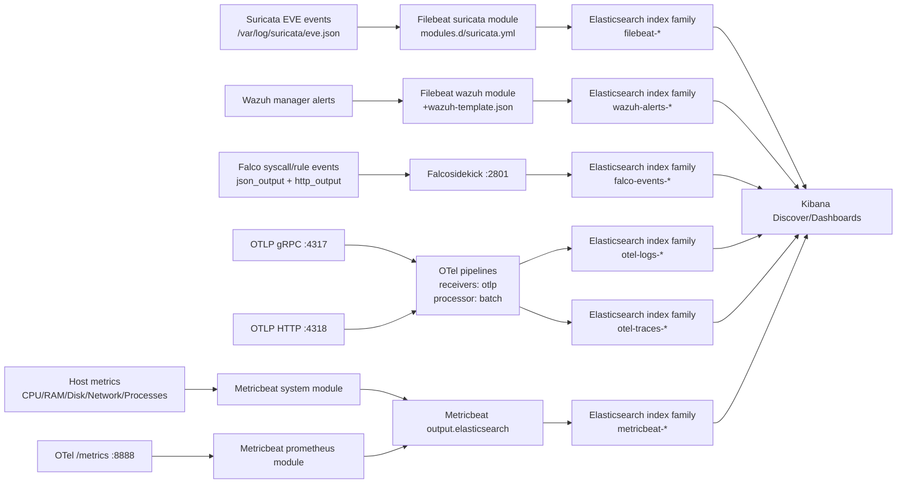
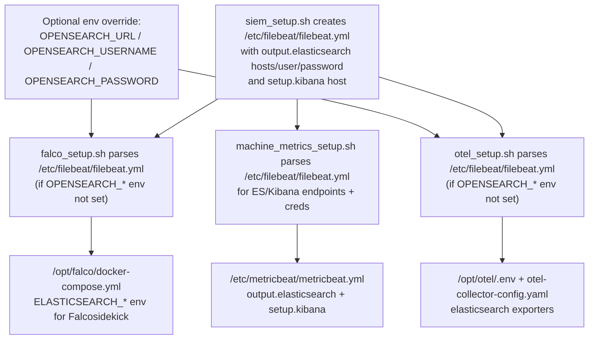
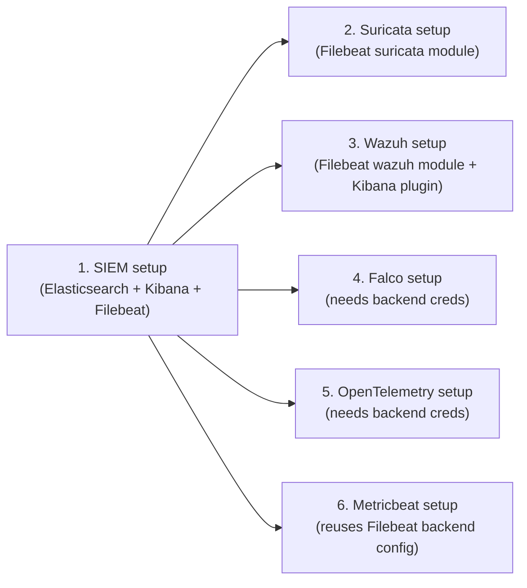

# Detailed Project Diagram (Services, Interactions, and Log Transit)

This document maps the full platform described by this repository, including setup orchestration, runtime service interactions, and telemetry/log paths into Elasticsearch/OpenSearch-compatible backends.

## 1) End-to-End Service Topology

## 2) Detailed Log/Telemetry Transit Paths

## 3) Control-Plane and Credential/Config Dependency Flow

## 4) Installation/Startup Dependency Graph

## 5) Port-Level Interaction Map

```mermaid
flowchart TB
  ES9200["Elasticsearch :9200 HTTPS"]
  KB5601["Kibana :5601 HTTPS"]
  W1514["Wazuh :1514 TCP"]
  W1515["Wazuh :1515 TCP"]
  F2801["Falcosidekick :2801 HTTP"]
  O4317["OTel OTLP gRPC :4317"]
  O4318["OTel OTLP HTTP :4318"]
  O13133["OTel Health :13133"]
  O8888["OTel Metrics :8888"]
  O55679["OTel zPages :55679"]
  OLLAMA11434["Ollama :11434"]
  WEBUI3000["Open-WebUI :3000 -> 8080"]

  Filebeat["Filebeat"] --> ES9200
  Kibana["Kibana server"] --> ES9200
  Analyst["Browser/Operator"] --> KB5601
  Agents["Wazuh agents"] --> W1515
  Agents --> W1514
  Falco["Falco"] --> F2801
  Falcosidekick["Falcosidekick"] --> ES9200
  OTLPClients["Telemetry clients"] --> O4317
  OTLPClients --> O4318
  Metricbeat["Metricbeat prometheus module"] --> O8888
  OTEL["OTel Collector"] --> O13133
  OTEL --> O55679
  OTEL --> ES9200
  WebUI["Open-WebUI"] --> OLLAMA11434
  UserAI["AI UI user"] --> WEBUI3000
```

